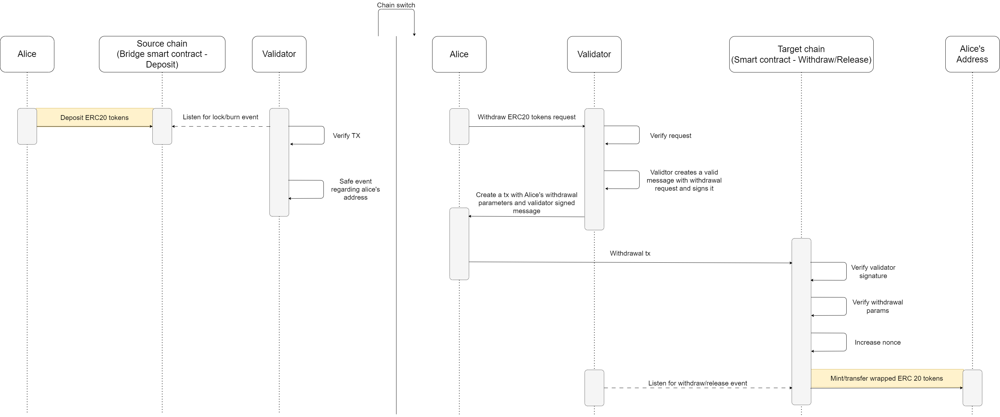

# Bridge for the EVM compatible chains for ERC20 tokens
> * ### The bridge is currently available and deployed on the Sepolia and Mumbai chains.  
> * ### Bridge supports [ERC20 Permits (EIP2612)](https://eips.ethereum.org/EIPS/eip-2612)
> * ### Related projects [EVMBridge Client](https://github.com/joYyHack/EVMBridge-client) and [EVMBridge Validator](https://github.com/joYyHack/EVMBridge-validator)

## Table of Contents
- [Table of Contents](#table-of-contents)
- [Overview](#overview)
- [Deployments](#deployments-by-evm-chain)
- [Diagram](#diagram)
- [Install](#install)
- [Usage](#usage)
- [.ENV file](#env-file)
- [Deploy scripts](#deploy)
## Overview

The Bridge smart contract provides a bidirectional transfer of ERC20 tokens between EVM-compatible chains. This means that users can move their tokens from Chain A to Chain B and vice versa with ease. Additionally, the Bridge supports the ERC20 Permit standard (ERC2612), enabling gasless transactions by pre-approving token transfers. With the Bridge, users have greater flexibility and control over their tokens, eliminating the need to rely on centralized exchanges or custodians for transfers between chains.
> The contracts in this project are used by the [EVMBridge Client](https://github.com/joYyHack/EVMBridge-client). You can use the client to visualize the interaction with the bridge. A guide on how to interact with the client can be found in the respective project.
## Deployments by EVM Chain

<table>
<tr>
<th>Network</th>
<th>Bridge</th>
<th>ERC20 Safe</th>
<th>Validator</th>
</tr>

<tr><td>Ethereum Sepolia</td><td>

[0xce56e2D1e03e653bc95F113177A2Be6002068B7E](https://sepolia.etherscan.io/address/0xce56e2D1e03e653bc95F113177A2Be6002068B7E#code)

</td><td>

[0x268653b20B3a3aE011A42d2b0D6b9F97eC42ca2d](https://sepolia.etherscan.io/address/0x268653b20B3a3aE011A42d2b0D6b9F97eC42ca2d#code)

</td><td>

[0xb564990E0fD557345f4e87F10ECA0F641a557671](https://sepolia.etherscan.io/address/0xb564990E0fD557345f4e87F10ECA0F641a557671#code)

</td></tr>
<tr><td>Polygon Mumbai</td><td>

[0xce56e2D1e03e653bc95F113177A2Be6002068B7E](https://mumbai.polygonscan.com/address/0xce56e2D1e03e653bc95F113177A2Be6002068B7E#code)

</td><td>

[0x268653b20B3a3aE011A42d2b0D6b9F97eC42ca2d](https://mumbai.polygonscan.com/address/0x268653b20B3a3aE011A42d2b0D6b9F97eC42ca2d#code)

</td><td>

[0xb564990E0fD557345f4e87F10ECA0F641a557671](https://mumbai.polygonscan.com/address/0xb564990E0fD557345f4e87F10ECA0F641a557671#code)

</td></tr>
</table>
  
## Diagram
  
#### User flow

## Install

```bash
git clone https://github.com/joYyHack/EVMBridge.git
npm install
npx hardhat clean
npx hardhat compile
```

## Usage

To run hardhat tests written in typescript:

```bash
npx hardhat test
```
To run hardhat coverage:

```bash
npx hardhat coverage --config ./hardhat-coverage.config.ts
```

## .ENV file

In order to deploy contracts to the EVM network or verify them, you need to set up the .env file with the specified API keys and private keys. Here is an example .env file:
```env
IS_ENV_SET=false

ALCHEMY_SEPOLIA_API_KEY="api-key"
ALCHEMY_MUMBAI_API_KEY="api-key"

ALICE_PRIV_KEY="priv-key"
BRIDGE_OWNER_PRIV_KEY="priv-key"
VALIDATOR_OWNER_PRIV_KEY="priv-key"

ETHEREUM_ETHERSCAN_API_KEY="api-key"
POLYGON_ETHERSCAN_API_KEY="api-key"
```
> #### If you have set the .env file don't forget to switch `IS_ENV_SET` to true

## Deploy
To deploy Bridge with all dependencies:
```bash
npx hardhat run .\scripts\deploy.ts
```

To deploy ERC20 token and ERC20 permit token:
```bash
npx hardhat run .\scripts\deployERC20.ts
```
